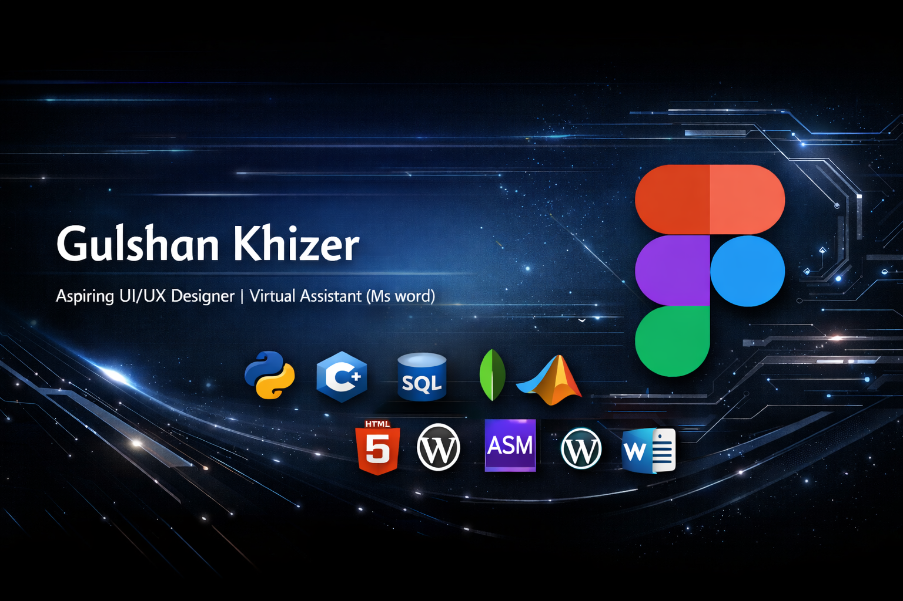

  

#  Hi, I'm Gulshan Khizer

---

## 👨‍💻 About Me

- 🎨 Aspiring **UI/UX Designer**
- 💻 Learning **Python, C++, SQL**
- 🧠 Interested in **AI Projects & Algorithms**
- 📝 **MS Word Specialist & Virtual Assistant**
- 🌍 Building projects and improving my **GitHub portfolio**

---

## 📊 My GitHub Stats & Streaks

  <!-- GitHub Stats Card -->
  
  
    
  
  <!-- GitHub Streak Stats -->
  

### 🛠️ Technical Proficiency

| Category | Technologies |
|:--|:--|
| **Languages** |      |
| **Databases** |    |
| **Design Tools** |   |
| **AI Platforms** |    |
| **CMS & Website** |   |
| **Tools** |   |

## 🌐 Connect With Me

&nbsp;&nbsp;&nbsp;&nbsp;

&nbsp;&nbsp;&nbsp;&nbsp;

&nbsp;&nbsp;&nbsp;&nbsp;

<b>Connect</b> • <b>Hire Me</b> • <b>Follow</b> • <b>Email</b>

